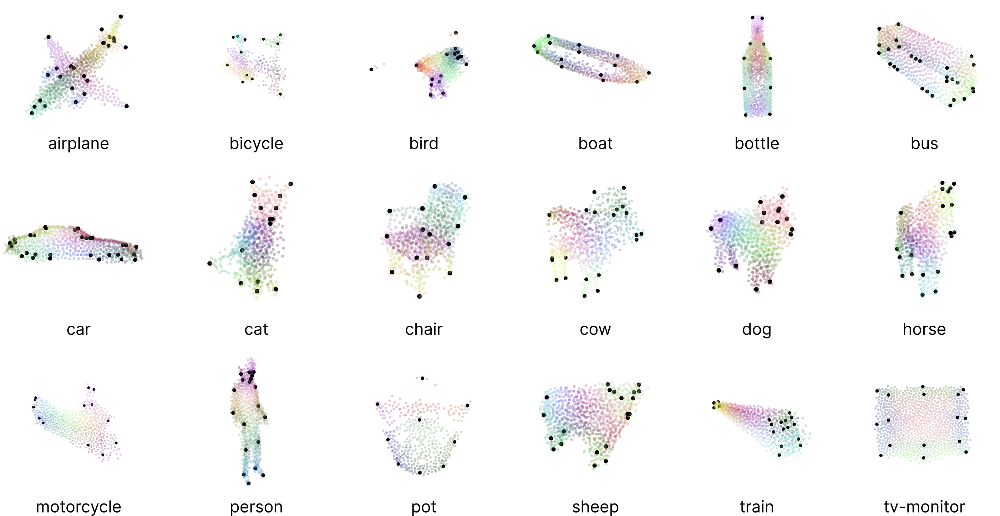

# SemAlign3D: Semantic Correspondence between RGB-Images through Aligning 3D Object-Class Representations

This repository contains the code for the paper titled **"SemAlign3D: Semantic Correspondence between RGB-Images through Aligning 3D Object-Class Representations"** (CVPR 2025). Website: https://semalign3d.papers.discuna.com

## Announcements

- **2025/07/10**: Part 1 of SemAlign3D released! You can now generate the **3D Shape Priors**! Additionally, we fixed some bugs and made some performance improvements which leads to overall better results compared to the results shown in our paper and faster shape generation. Part 2 for alignment and evaluation will follow soon.


## System Requirements

This code has been tested on an RTX3090 + 64G RAM and Ubuntu 22.04. Furthermore, we primarily conduct experiments on SPair-71k. While we also provide adapters to other datasets such as AP-10k and PF-Pascal, you might have to adjust some parameters to avoid hitting memory limits.


## Encode Images with GeoAware-SC

Please follow GeoAware-SC (https://github.com/Junyi42/GeoAware-SC) to generate Stable Diffusion (SD) and DINOv2 features for images in the SPair-71k dataset. Save them to a directory of your choice. Make sure to create a subfolder for each cateogory.
```
# <PATH_TO_ENCODED_IMAGES>/<CATEGORY>

2008_000585_sd.pt
2008_000585_sd_flip.pt // flip means image is mirrored left <-> right
2008_000585_dino.pt
2008_000585_dino_flip.pt
...
```

Please note that in order to reproduce our benchmark results you may use GeoAware-SC. However, in theory you could also use any other image encoder.

## Install

We highly recommend creating a new environment for SemAlign3D. In particular, do not re-use the environment from GeoAware-SC to avoid package version conflicts.

```
conda create --name semalign3d python=3.10 
```

After cloning this repository, install the semalign3d package with the following command:
```
cd semalign3d
conda activate semalign3d
pip install -e . \
--extra-index-url https://download.pytorch.org/whl/cu121 \
--extra-index-url https://pypi.nvidia.com
```

## Configure

Create the following configuration file in `./scripts/run_config.yaml`
```
# scripts/run_config.yaml

dataset_name: spair-71k
spair_data_dir: <PATH_TO_SPair-71k>

semalign3d_data_dir: <PATH_OF_YOUR_CHOICE>
embds_folder: <PATH_TO_ENCODED_IMAGES>

sam_vit_h_ckpt_path: <PATH_TO_SAM_CKPT>.pth
aggre_net_ckpt_path: <GEO_AWARE_SC_DIR>/results_spair/best_856.PTH

# For reproduction, use depth_any. You can also use `vggt` but we did not observe significant changes.
depth_generator: depth_any
suffix: _depth_any
```

## Part 1: Generate 3D Shape Priors

Simply run the following commands:

```
conda activate semalign3d

# Takes around 10-20 minutes per category
python scripts/generate.py [category]
```

You can visualize the 3D shape priors using the notebooks in `./notebooks`. You should get results similar to the following:




# Cite

If you found this repository useful, please consider citing:

```
@inproceedings{wandel2025semalign3d,
  title     = {SemAlign3D: Semantic Correspondence between RGB-Images through Aligning 3D Object-Class Representations},
  author    = {Wandel, Krispin and Wang, Hesheng},
  booktitle = {Proceedings of the IEEE/CVF Conference on Computer Vision and Pattern Recognition (CVPR)},
  year      = {2025},
  note      = {Poster}
}
```


